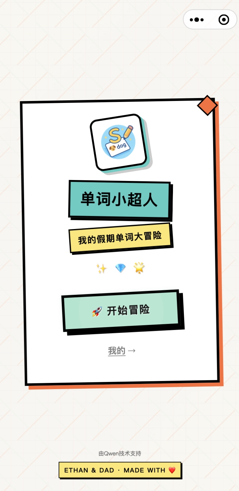
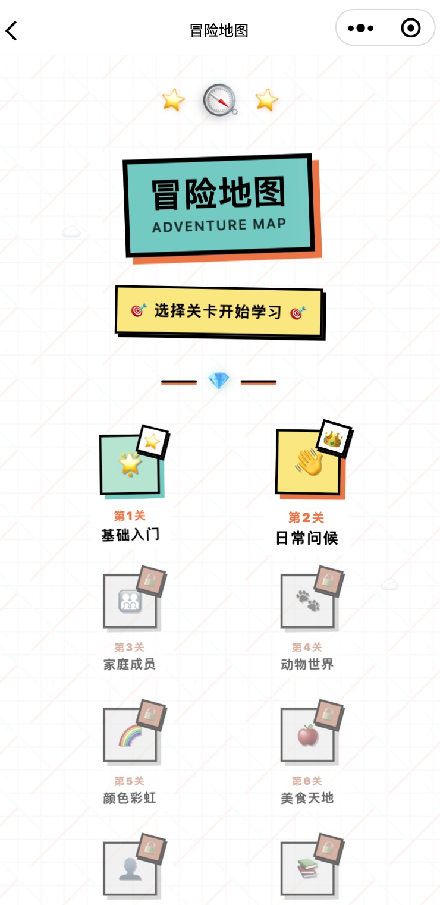
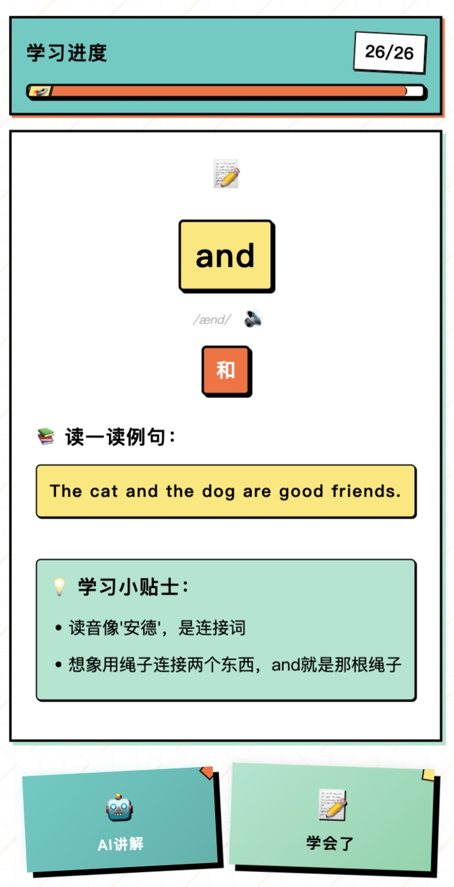
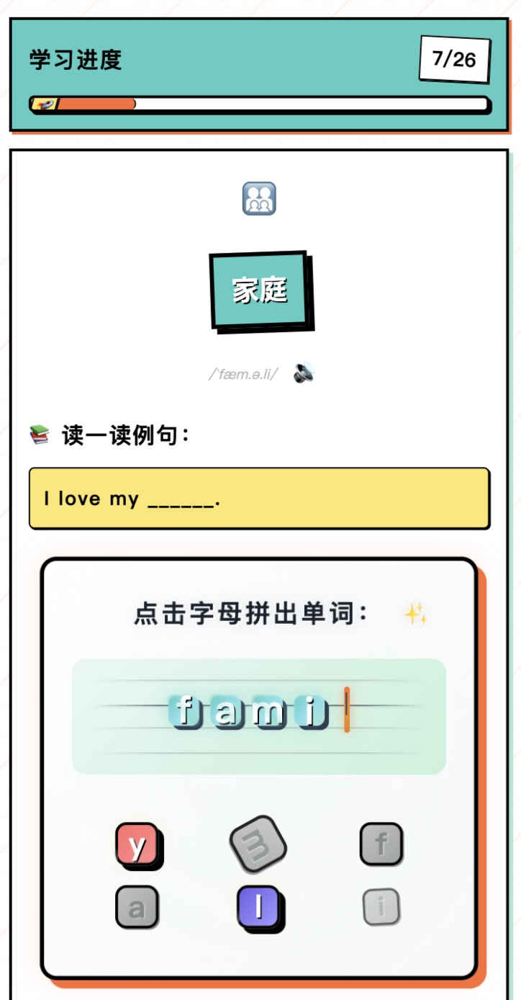
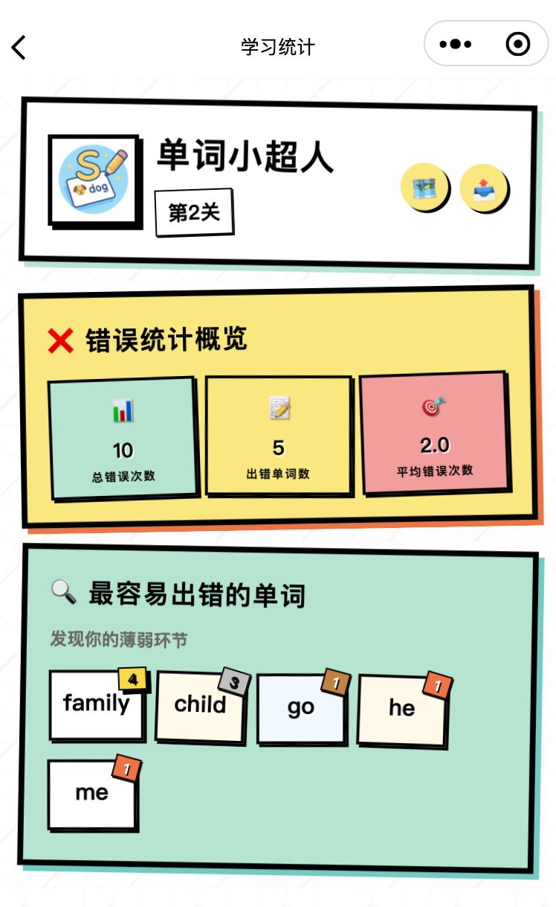
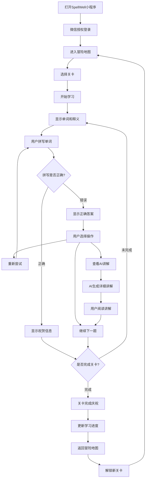

# SpellWell英语单词学习小程序用户手册

## 目录

1. [软件简介](#1-软件简介)
2. [安装与启动](#2-安装与启动)
3. [功能介绍](#3-功能介绍)
4. [操作指南](#4-操作指南)
5. [常见问题](#5-常见问题)
6. [技术支持](#6-技术支持)

---

## 1. 软件简介

### 1.1 产品概述
SpellWell是一款专为小学生设计的英语单词学习微信小程序。通过游戏化的学习方式，帮助学生在轻松愉快的环境中掌握英语单词拼写，提高学习兴趣和学习效果。

### 1.2 主要特色
- **游戏化学习**：采用冒险地图、关卡挑战等游戏元素
- **AI智能讲解**：提供个性化的单词解释和记忆技巧
- **自适应学习**：根据学习情况智能调整难度
- **详细统计**：全面的学习数据分析和进度跟踪
- **离线学习**：支持无网络环境下的学习

### 1.3 适用对象
- **主要用户**：小学1-6年级学生
- **辅助用户**：家长、老师
- **设备要求**：支持微信的智能手机或平板电脑

---

## 2. 安装与启动

### 2.1 获取小程序

#### 方法一：微信搜索
1. 打开微信APP
2. 点击顶部搜索框
3. 输入"SpellWell"或"英语单词学习"
4. 在搜索结果中找到SpellWell小程序
5. 点击进入

#### 方法二：扫描二维码
1. 打开微信APP
2. 点击右上角"+"号
3. 选择"扫一扫"
4. 扫描SpellWell小程序二维码
5. 点击进入小程序

#### 方法三：好友分享
1. 通过好友分享的小程序链接
2. 点击链接直接进入

### 2.2 首次启动

#### 2.2.1 授权登录
1. 首次打开小程序时，会显示授权页面
2. 点击"授权登录"按钮
3. 确认微信授权信息
4. 系统自动创建用户档案

#### 2.2.2 选择年级
1. 在欢迎页面选择当前年级（1-6年级）
2. 系统会根据年级推荐相应的词汇库
3. 可以随时在设置中修改年级

#### 2.2.3 完成设置
1. 系统自动初始化学习数据
2. 进入冒险地图主页面
3. 开始学习之旅

---

## 3. 功能介绍

### 3.1 冒险地图

#### 3.1.1 界面说明
- **地图路径**：显示学习进度路线
- **关卡节点**：每个节点代表一组单词
- **进度显示**：当前完成的关卡数量
- **用户信息**：显示头像、昵称、年级

#### 3.1.2 关卡状态
- **未解锁**：灰色显示，需要完成前置关卡
- **可挑战**：彩色显示，可以点击进入学习
- **已完成**：带有完成标记，可以重复学习

### 3.2 单词学习

#### 3.2.1 学习模式
- **认识模式**：显示单词和中文释义，熟悉单词
- **拼写模式**：根据中文释义拼写英文单词
- **听写模式**：根据语音提示拼写单词

#### 3.2.2 学习界面
- **单词显示区**：显示当前学习的单词信息
- **输入区域**：用户输入拼写答案
- **提示按钮**：获取拼写提示
- **发音按钮**：播放单词发音
- **进度条**：显示当前关卡进度

### 3.3 AI讲解

#### 3.3.1 功能特点
- **智能解释**：AI生成的详细单词解释
- **记忆技巧**：提供有效的记忆方法
- **例句展示**：丰富的例句帮助理解
- **发音指导**：音标和发音技巧

#### 3.3.2 使用方法
1. 在学习页面点击"AI讲解"按钮
2. 系统自动生成讲解内容
3. 阅读详细的单词解释
4. 点击"返回学习"继续练习

### 3.4 学习统计

#### 3.4.1 总体统计
- **学习天数**：累计学习天数
- **掌握单词**：已掌握的单词数量
- **学习时长**：总学习时间
- **平均准确率**：拼写准确率统计

#### 3.4.2 错误分析
- **错误单词列表**：显示经常拼错的单词
- **错误类型分析**：分析错误原因
- **改进建议**：提供针对性的学习建议

---

## 4. 操作指南

### 4.1 核心学习流程图

### 4.2 开始学习

#### 4.1.1 选择关卡
1. 在冒险地图页面浏览可用关卡
2. 点击想要挑战的关卡节点
3. 查看关卡预览信息
4. 点击"开始挑战"按钮

#### 4.1.2 学习流程
1. **认识单词**
   - 仔细阅读单词和释义
   - 点击发音按钮听取读音
   - 理解单词含义

2. **拼写练习**
   - 根据中文释义拼写英文单词
   - 在输入框中输入答案
   - 点击"提交"按钮检查答案

3. **结果反馈**
   - 正确：显示祝贺信息，自动进入下一题
   - 错误：显示正确答案和错误提示
   - 可以选择重新尝试或查看AI讲解

### 4.2 使用AI讲解

#### 4.2.1 获取讲解
1. 在学习页面遇到困难单词
2. 点击"AI讲解"按钮
3. 等待AI生成讲解内容（通常2-3秒）
4. 阅读详细的单词解释

#### 4.2.2 讲解内容
- **基本信息**：音标、词性、基本释义
- **详细解释**：词汇来源、用法说明
- **记忆技巧**：联想记忆、词根词缀等方法
- **例句展示**：实际使用场景的例句

### 4.3 查看学习统计

#### 4.3.1 进入统计页面
1. 在冒险地图页面点击"统计"按钮
2. 或者从底部导航栏进入统计页面

#### 4.3.2 查看统计信息
1. **总体数据**
   - 查看学习天数、掌握单词数等
   - 了解整体学习进度

2. **错误分析**
   - 查看经常出错的单词
   - 分析错误原因和类型
   - 制定针对性的复习计划

3. **学习趋势**
   - 查看每日学习情况
   - 了解学习效果变化

### 4.4 设置和个性化

#### 4.4.1 修改个人信息
1. 点击头像或设置按钮
2. 进入个人设置页面
3. 修改昵称、年级等信息
4. 保存设置

#### 4.4.2 学习设置
1. **年级调整**：根据实际水平调整年级
2. **难度设置**：选择适合的学习难度
3. **提醒设置**：设置学习提醒时间

---

## 5. 常见问题

### 5.1 登录和授权问题

**Q：为什么需要微信授权？**
A：授权是为了获取您的基本信息（如昵称、头像），用于创建个人学习档案。我们不会获取您的其他隐私信息。

**Q：可以不授权使用吗？**
A：不可以。授权是小程序正常运行的必要条件，用于保存您的学习进度和个人设置。

### 5.2 学习功能问题

**Q：为什么有些关卡无法进入？**
A：关卡采用循序渐进的设计，需要完成前面的关卡才能解锁后续关卡。这样可以确保学习的连贯性和效果。

**Q：拼写错误后可以重新尝试吗？**
A：可以。每个单词都有多次尝试机会，错误后会显示提示信息，帮助您找到正确答案。

**Q：AI讲解加载很慢怎么办？**
A：AI讲解需要网络连接。如果加载慢，请检查网络连接。如果网络正常但仍然很慢，系统会提供预设的讲解内容。

### 5.3 数据和进度问题

**Q：学习进度会丢失吗？**
A：学习进度保存在本地，正常情况下不会丢失。但建议定期使用小程序，避免长时间不使用导致缓存清理。

**Q：可以在不同设备上同步进度吗？**
A：目前进度保存在本地，不支持跨设备同步。建议在固定设备上使用以保持进度连续性。

**Q：如何重置学习进度？**
A：在设置页面可以找到"重置进度"选项，但请谨慎操作，重置后所有学习数据将清空。

### 5.4 技术问题

**Q：小程序无法打开怎么办？**
A：
1. 检查微信版本是否为最新版本
2. 检查网络连接是否正常
3. 尝试关闭微信后重新打开
4. 如果问题持续，请联系技术支持

**Q：发音功能不工作怎么办？**
A：
1. 检查手机音量设置
2. 确保微信有音频播放权限
3. 在安静环境下测试
4. 如果仍有问题，系统会提供震动反馈作为替代

**Q：页面显示异常怎么办？**
A：
1. 尝试下拉刷新页面
2. 关闭小程序后重新打开
3. 检查微信版本和手机系统版本
4. 联系技术支持报告具体问题

---

## 6. 技术支持

### 6.1 获取帮助

#### 6.1.1 在线帮助
- 在小程序内查看帮助文档
- 查看常见问题解答
- 观看操作演示视频

#### 6.1.2 联系我们
- **客服邮箱**：support@spellwell.com
- **反馈渠道**：小程序内反馈功能
- **工作时间**：周一至周五 9:00-18:00

### 6.2 问题反馈

#### 6.2.1 反馈内容
反馈问题时，请提供以下信息：
- 手机型号和系统版本
- 微信版本号
- 问题发生的具体步骤
- 问题截图或录屏
- 联系方式

#### 6.2.2 反馈渠道
1. **小程序内反馈**
   - 在设置页面找到"意见反馈"
   - 填写问题描述和联系方式
   - 提交反馈

2. **邮件反馈**
   - 发送邮件至support@spellwell.com
   - 详细描述问题和使用环境
   - 附上相关截图

### 6.3 版本更新

#### 6.3.1 更新通知
- 小程序会自动检查更新
- 有新版本时会提示用户
- 重要更新会强制更新

#### 6.3.2 更新内容
- 新功能介绍
- 问题修复说明
- 性能优化改进
- 用户体验提升

### 6.4 隐私保护

#### 6.4.1 数据收集
我们只收集必要的学习数据：
- 基本用户信息（昵称、头像）
- 学习进度和统计数据
- 使用行为数据（用于改进产品）

#### 6.4.2 数据使用
- 数据仅用于提供学习服务
- 不会泄露给第三方
- 用户可以随时删除个人数据

#### 6.4.3 数据安全
- 采用加密存储技术
- 定期进行安全检查
- 遵循相关法律法规

---

## 附录

### A. 快捷操作
- **返回上级**：点击左上角返回按钮
- **刷新页面**：下拉页面刷新
- **快速跳转**：长按关卡节点快速预览
- **批量操作**：在统计页面可以批量处理错误单词

### B. 键盘快捷键
- **提交答案**：输入完成后直接点击键盘的"完成"或"搜索"键
- **清空输入**：长按输入框清空内容
- **快速重试**：双击输入框重新开始当前单词

### C. 学习建议
1. **每日坚持**：建议每天学习15-30分钟
2. **循序渐进**：按照关卡顺序学习，不要跳跃
3. **及时复习**：定期复习错误单词
4. **合理休息**：避免长时间连续学习
5. **家长陪伴**：建议家长适当陪伴和鼓励

---

**用户手册版本**：v1.0  
**更新日期**：2025年  