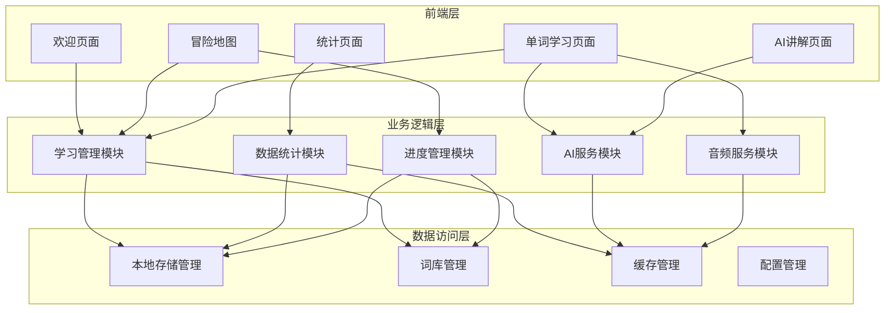
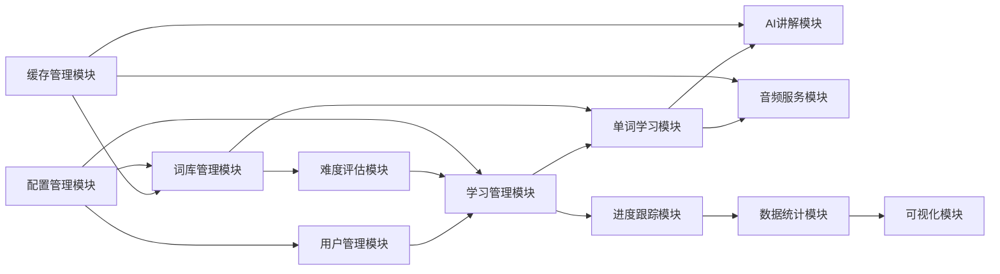
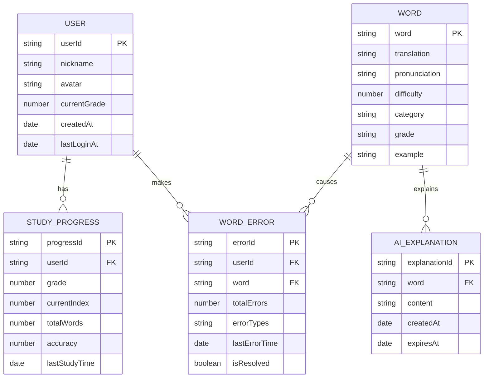

# SpellWell英语单词学习小程序设计说明书

## 1. 引言

### 1.1 编写目的
本文档旨在详细描述SpellWell英语单词学习小程序的系统设计，为开发人员提供系统架构、模块设计、数据库设计等技术实现的详细说明。

### 1.2 项目背景
SpellWell是一款专为小学生设计的英语单词学习微信小程序，通过游戏化的学习方式，帮助学生提高英语单词拼写能力和学习兴趣。

### 1.3 定义
- **小程序**：基于微信平台的轻量级应用程序
- **AI讲解**：基于人工智能技术的单词解释功能
- **自适应学习**：根据学生学习情况调整难度的学习模式

## 2. 系统概述

### 2.1 系统目标
- 提供趣味性的英语单词学习体验
- 支持多年级词汇库管理
- 实现智能化的学习进度跟踪
- 提供个性化的学习建议

### 2.2 系统特点
- 游戏化学习界面
- AI智能讲解功能
- 自适应难度调整
- 详细的学习统计分析
- 离线学习支持

## 3. 系统架构设计

### 3.1 总体架构



### 3.2 技术架构
- **前端框架**：微信小程序原生框架
- **编程语言**：JavaScript ES6+
- **数据存储**：微信小程序本地存储API
- **UI组件**：自定义组件 + 微信原生组件

## 4. 功能模块设计

### 4.1 核心模块关系图



### 4.2 学习模块

#### 4.1.1 单词学习页面
- **文件位置**：`pages/study/study.js`
- **主要功能**：
  - 单词显示与拼写练习
  - 实时拼写检查
  - 错误提示与纠正
  - 学习进度跟踪

#### 4.1.2 关键算法
```javascript
// 拼写检查算法
checkSpelling(userInput, correctWord) {
  const similarity = this.calculateSimilarity(userInput, correctWord)
  if (similarity >= 0.8) {
    return { correct: true, score: 100 }
  } else {
    return { 
      correct: false, 
      hints: this.generateHints(userInput, correctWord)
    }
  }
}
```

### 4.2 AI讲解模块

#### 4.2.1 AI服务
- **文件位置**：`utils/ai-service.js`
- **主要功能**：
  - 单词智能解释
  - 例句生成
  - 记忆技巧提供
  - 缓存管理

#### 4.2.2 实现原理
```javascript
// AI讲解生成
async generateWordExplanation(word, options) {
  // 1. 检查缓存
  const cached = this.getFromCache(word)
  if (cached) return cached
  
  // 2. 生成讲解内容
  const explanation = await this.generateContent(word, options)
  
  // 3. 缓存结果
  this.saveToCache(word, explanation)
  
  return explanation
}
```

### 4.3 数据管理模块

#### 4.3.1 词库管理
- **文件位置**：`utils/word-library.js`
- **数据结构**：
```javascript
{
  grade1: [
    {
      word: "apple",
      translation: "苹果",
      pronunciation: "/ˈæpl/",
      difficulty: 1,
      category: "fruit"
    }
  ]
}
```

#### 4.3.2 学习数据管理
- **文件位置**：`utils/data-manager.js`
- **存储结构**：
```javascript
{
  userId: "user_123",
  profile: {
    currentGrade: 3,
    totalWords: 150,
    accuracy: 85.5,
    studyDays: 30
  },
  progress: {
    completedWords: ["apple", "book"],
    errorWords: ["difficult", "beautiful"]
  }
}
```

### 4.4 统计分析模块

#### 4.4.1 学习统计
- **文件位置**：`pages/statistics/statistics.js`
- **统计指标**：
  - 学习总时长
  - 单词掌握数量
  - 拼写准确率
  - 学习连续天数
  - 错误单词分析

#### 4.4.2 数据可视化
```javascript
// 生成学习趋势图数据
generateChartData(studyHistory) {
  return studyHistory.map(day => ({
    date: day.date,
    accuracy: day.accuracy,
    wordsLearned: day.wordsLearned
  }))
}
```

## 5. 数据库设计

### 5.1 数据实体关系图



### 5.2 数据存储方案
由于微信小程序的限制，系统采用本地存储方案：

#### 5.1.1 用户配置数据
- **存储键**：`wordHero_profile`
- **数据结构**：
```javascript
{
  userId: String,
  nickname: String,
  avatar: String,
  currentGrade: Number,
  createdAt: Date,
  lastLoginAt: Date
}
```

#### 5.1.2 学习进度数据
- **存储键**：`study_progress_${grade}`
- **数据结构**：
```javascript
{
  grade: Number,
  completedWords: Array,
  currentIndex: Number,
  totalWords: Number,
  accuracy: Number,
  lastStudyTime: Date
}
```

#### 5.1.3 错误记录数据
- **存储键**：`word_errors_${word}`
- **数据结构**：
```javascript
{
  word: String,
  totalErrors: Number,
  errorTypes: Array,
  lastErrorTime: Date,
  isResolved: Boolean
}
```

### 5.2 缓存设计

#### 5.2.1 AI讲解缓存
- **存储键**：`ai_explanation_${word}`
- **过期时间**：7天
- **清理策略**：LRU算法

#### 5.2.2 词库缓存
- **存储键**：`word_library_${grade}`
- **更新策略**：版本号比较

## 6. 接口设计

### 6.1 内部模块接口

#### 6.1.1 学习管理接口
```javascript
// 获取下一个单词
getNextWord(grade, currentIndex)

// 提交拼写结果
submitSpelling(word, userInput, timeSpent)

// 获取学习进度
getStudyProgress(grade)
```

#### 6.1.2 数据统计接口
```javascript
// 获取总体统计
getOverallStats(userId)

// 获取错误单词统计
getErrorWordsStats(userId)

// 更新学习记录
updateStudyRecord(record)
```

### 6.2 工具函数接口

#### 6.2.1 存储工具
```javascript
// 同步存储
storage.set(key, value)
storage.get(key, defaultValue)

// 异步存储
storage.setAsync(key, value)
storage.getAsync(key, defaultValue)
```

#### 6.2.2 UI工具
```javascript
// 页面跳转
navigateToPage(url, params)

// 消息提示
showToast(message, type)
showModal(title, content)
```

## 7. 安全设计

### 7.1 数据安全
- **本地存储加密**：敏感数据使用AES加密
- **数据校验**：关键数据添加校验和
- **访问控制**：限制数据访问权限

### 7.2 用户隐私
- **最小化原则**：只收集必要的用户信息
- **数据匿名化**：统计数据不包含个人标识
- **本地存储**：用户数据仅存储在本地

## 8. 性能优化

### 8.1 加载优化
- **懒加载**：按需加载词库数据
- **预加载**：提前加载下一批单词
- **缓存策略**：合理使用缓存减少计算

### 8.2 内存优化
- **对象池**：复用频繁创建的对象
- **及时清理**：清理不再使用的数据
- **分页加载**：大数据集分页处理

### 8.3 代码优化
```javascript
// 防抖处理用户输入
const debouncedCheck = debounce(this.checkSpelling, 300)

// 节流处理频繁操作
const throttledUpdate = throttle(this.updateProgress, 1000)
```

## 9. 错误处理

### 9.1 异常捕获
```javascript
try {
  const result = await this.processWord(word)
  return result
} catch (error) {
  console.error('处理单词失败:', error)
  this.handleError(error)
  return this.getFallbackResult(word)
}
```

### 9.2 降级策略
- **AI服务失败**：使用预设解释
- **网络异常**：启用离线模式
- **存储失败**：使用内存缓存

## 10. 测试设计

### 10.1 单元测试
- **工具函数测试**：验证基础功能正确性
- **算法测试**：验证拼写检查算法
- **数据处理测试**：验证数据存储和读取

### 10.2 集成测试
- **页面流程测试**：验证用户操作流程
- **数据一致性测试**：验证数据同步正确性
- **性能测试**：验证系统响应时间

## 11. 部署说明

### 11.1 开发环境
- **微信开发者工具**：最新稳定版
- **Node.js**：v14.0+
- **操作系统**：Windows/macOS/Linux

### 11.2 发布流程
1. 代码审查和测试
2. 版本号更新
3. 微信开发者工具上传
4. 提交审核
5. 发布上线

## 12. 维护说明

### 12.1 日志管理
- **错误日志**：记录系统异常信息
- **用户行为日志**：记录关键操作
- **性能日志**：记录系统性能指标

### 12.2 版本管理
- **语义化版本**：主版本.次版本.修订版本
- **变更日志**：详细记录每次更新内容
- **兼容性处理**：保证向后兼容性

---

**文档版本**：v1.0  
**编写日期**：2024年  