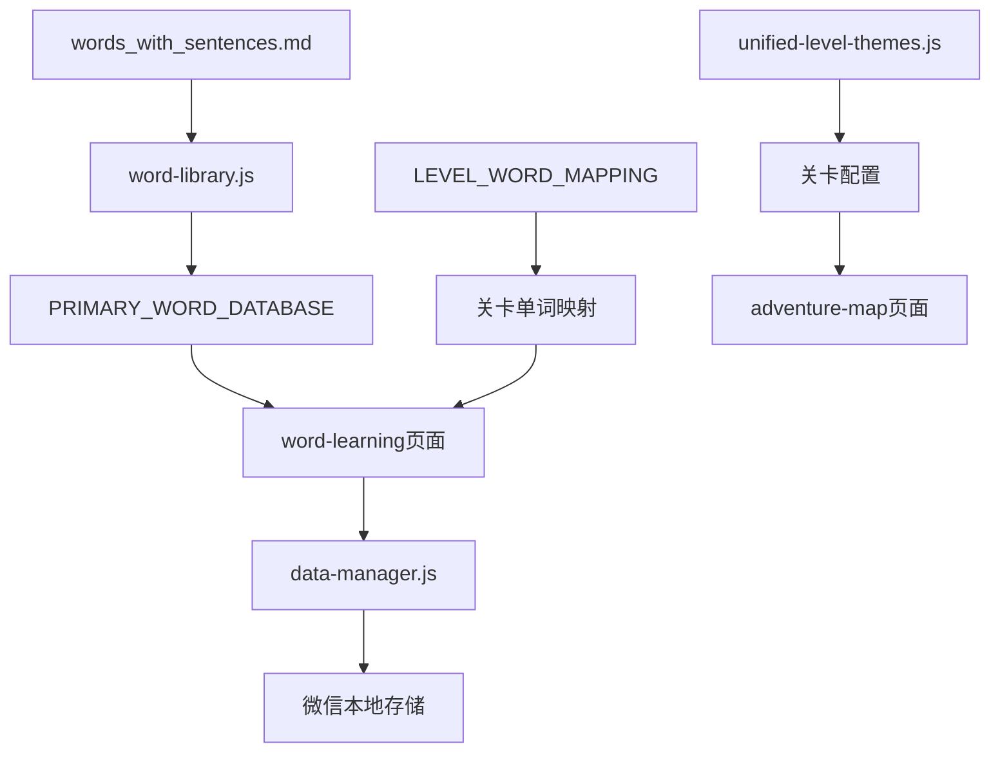
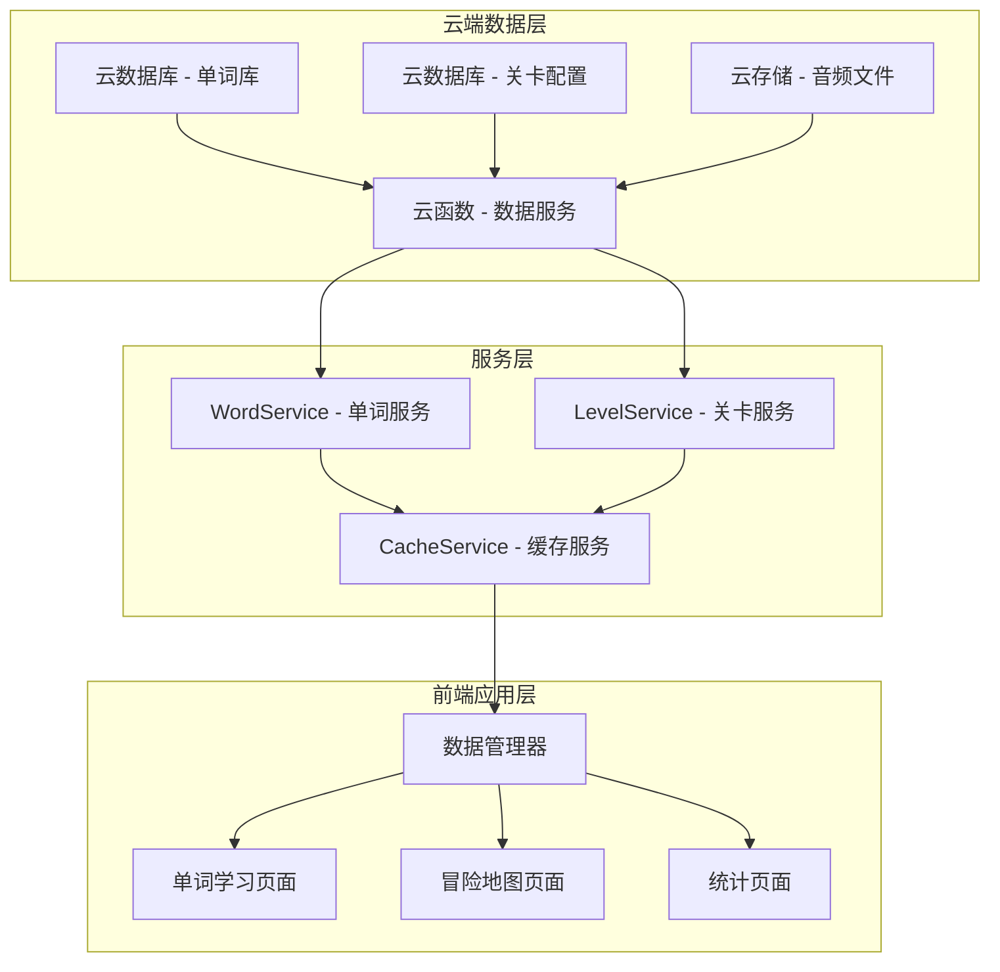

# SpellWell 单词学习小程序重构架构设计方案

## 📋 执行摘要

本文档是对 SpellWell 微信小程序进行全面架构重构的详细设计方案。通过深度分析现有项目架构，识别出关键痛点，并提供一套完整的解决方案，旨在实现单词库的标准化、模块化和云端化管理，显著提升项目的可维护性和扩展性。

---

## 🎯 1. 项目现状深度分析

### 1.1 项目概览
- **项目类型**: 微信小程序（英语单词学习应用）
- **核心功能**: 单词学习、关卡挑战、AI讲解、进度统计
- **技术栈**: 微信小程序原生开发 + 腾讯云开发
- **单词库规模**: 507个小学英语单词
- **关卡体系**: 20个主题关卡

### 1.2 当前架构分析

#### 核心模块结构
```
SpellWell/
├── app.js                          # 小程序入口
├── pages/                          # 页面模块
│   ├── welcome/                    # 欢迎页面
│   ├── adventure-map/              # 冒险地图(关卡选择)
│   ├── word-learning/              # 核心学习页面
│   ├── statistics/                 # 学习统计
│   └── ai-explanation/             # AI讲解页面
├── utils/                          # 核心工具模块
│   ├── word-library.js            # 单词库(88640 tokens)
│   ├── unified-level-themes.js    # 关卡主题配置
│   ├── data-manager.js            # 数据管理器
│   ├── ai-service.js              # AI服务
│   └── audio-service.js           # 音频服务
├── cloudbase/                     # 云开发资源
└── _readme/                       # 原始数据源
    └── words_with_sentences.md    # 单词源数据
```

#### 数据流架构分析


---

## 🚨 2. 架构问题识别

### 2.1 数据管理层问题

#### ❌ 问题1: 单词库硬编码
- **现状**: 507个单词直接嵌入在 `word-library.js` 文件中，文件大小达到88640 tokens
- **影响**: 
  - 增加小程序包体积
  - 每次单词更新需要重新发版
  - 内存占用过大（所有单词一次性加载）
- **风险评级**: 🔴 HIGH

#### ❌ 问题2: 数据源分散且不一致
- **现状**: 
  - 原始数据在 `_readme/words_with_sentences.md`
  - 生产数据在 `word-library.js`
  - 缺乏自动同步机制
- **影响**: 数据不一致风险、维护困难
- **风险评级**: 🟡 MEDIUM

#### ❌ 问题3: 关卡配置复杂化
- **现状**: 关卡配置分散在三个位置：
  - `unified-level-themes.js` (关卡元数据)
  - `word-library.js` 的 `LEVEL_WORD_MAPPING` (单词映射)
  - `getLevelConfiguration()` 函数 (硬编码配置)
- **影响**: 配置维护复杂，容易产生不一致
- **风险评级**: 🟡 MEDIUM

### 2.2 性能与扩展性问题

#### ❌ 问题4: 无按需加载机制
- **现状**: 所有单词在应用启动时加载
- **影响**: 启动性能差，内存使用效率低
- **风险评级**: 🟡 MEDIUM

#### ❌ 问题5: 缺乏动态配置能力
- **现状**: 无法实现：
  - A/B测试不同单词库版本
  - 个性化单词推荐
  - 动态调整关卡难度
- **影响**: 产品迭代受限
- **风险评级**: 🟡 MEDIUM

### 2.3 开发与维护问题

#### ❌ 问题6: 内容管理门槛高
- **现状**: 单词库编辑需要开发技能
- **影响**: 非技术人员无法参与内容维护
- **风险评级**: 🟡 MEDIUM

#### ❌ 问题7: 版本控制缺失
- **现状**: 单词库变更无版本记录
- **影响**: 无法回滚、难以追踪变更历史
- **风险评级**: 🟡 MEDIUM

---

## 🏗️ 3. 新架构设计方案

### 3.1 整体架构设计

#### 设计原则
1. **数据与逻辑分离**: 单词数据完全独立于应用逻辑
2. **云端化管理**: 数据存储在云端，支持动态更新
3. **按需加载**: 实现数据的按需获取和缓存
4. **标准化格式**: 定义标准的JSON数据格式
5. **向后兼容**: 保证重构过程中的功能连续性

#### 新架构图


### 3.2 云端数据层设计

#### 3.2.1 单词数据库设计
**集合名称**: `words`

**数据结构**:
```json
{
  "_id": "ObjectId",
  "word": "apple",
  "metadata": {
    "phonetic": "/ˈæp.əl/",
    "syllables": ["ap", "ple"],
    "difficulty": "easy",
    "category": "美食天地",
    "grade_level": 1
  },
  "content": {
    "chinese": "苹果",
    "sentence_en": "The red apple is on the teacher's desk.",
    "sentence_cn": "红苹果在老师的桌子上。",
    "tips": [
      "水果类单词，联想红苹果的颜色和形状",
      "发音要注意双p不要发成单p"
    ],
    "image_emoji": "🍎"
  },
  "learning": {
    "memory_techniques": ["联想记忆", "图像记忆"],
    "common_errors": ["拼写apple时容易漏掉一个p"],
    "difficulty_score": 2.5
  },
  "system": {
    "created_at": "2024-01-01T00:00:00Z",
    "updated_at": "2024-01-01T00:00:00Z",
    "version": "1.0",
    "status": "active"
  }
}
```

#### 3.2.2 关卡配置数据库
**集合名称**: `level_configs`

**数据结构**:
```json
{
  "_id": "ObjectId",
  "level_id": 1,
  "metadata": {
    "name": "英语启蒙",
    "subtitle": "第一次相遇",
    "description": "最简单的英语单词，开始英语之旅",
    "icon": "🌟",
    "theme_color": "#FFD700"
  },
  "words": [
    {
      "word": "a",
      "priority": 1,
      "is_key_word": true
    },
    {
      "word": "hello", 
      "priority": 2,
      "is_key_word": true
    }
  ],
  "settings": {
    "target_words_count": 25,
    "difficulty_level": "beginner",
    "estimated_duration": "15-20分钟",
    "unlock_condition": {
      "type": "level_completion",
      "required_level": 0
    }
  },
  "learning_goals": [
    "认识英语字母组合",
    "学会基础发音", 
    "建立学习信心"
  ],
  "system": {
    "created_at": "2024-01-01T00:00:00Z",
    "updated_at": "2024-01-01T00:00:00Z",
    "version": "1.0",
    "status": "active"
  }
}
```

#### 3.2.3 用户进度数据库
**集合名称**: `user_progress`

**数据结构**:
```json
{
  "_id": "ObjectId",
  "user_id": "wx_openid_xxxxx",
  "current_level": 5,
  "total_words_learned": 127,
  "level_progress": {
    "1": {
      "status": "completed",
      "completion_time": "2024-01-15T10:30:00Z",
      "accuracy_rate": 0.95,
      "words_mastered": 25,
      "retry_count": 1
    }
  },
  "word_progress": {
    "apple": {
      "mastery_level": "expert",
      "correct_count": 5,
      "error_count": 1,
      "last_review": "2024-01-15T14:20:00Z",
      "next_review": "2024-01-22T14:20:00Z"
    }
  },
  "learning_analytics": {
    "total_study_time": 3600,
    "daily_streak": 7,
    "preferred_difficulty": "medium",
    "error_patterns": ["拼写错误", "音标混淆"]
  }
}
```

### 3.3 服务层架构

#### 3.3.1 云函数服务设计
**函数名称**: `word-service`

**核心API**:
```javascript
// 获取关卡单词
GET /getLevelWords
{
  "level_id": 1,
  "include_metadata": true
}

// 获取单词详情
GET /getWordDetail  
{
  "word": "apple",
  "include_learning_data": true
}

// 批量获取单词
GET /getWordsBatch
{
  "words": ["apple", "banana", "cat"],
  "fields": ["content", "metadata"]
}

// 搜索单词
GET /searchWords
{
  "query": "动物",
  "category": "动物世界",
  "difficulty": "easy",
  "limit": 20
}

// 获取推荐单词
GET /getRecommendedWords
{
  "user_id": "wx_openid_xxxxx",
  "count": 10,
  "difficulty_preference": "adaptive"
}
```

#### 3.3.2 前端服务层重构
**新文件结构**:
```
utils/
├── services/
│   ├── WordService.js          # 单词数据服务
│   ├── LevelService.js         # 关卡配置服务  
│   ├── UserProgressService.js  # 用户进度服务
│   ├── CacheService.js         # 缓存管理服务
│   └── AnalyticsService.js     # 学习分析服务
├── models/
│   ├── Word.js                 # 单词数据模型
│   ├── Level.js                # 关卡数据模型
│   └── UserProgress.js         # 用户进度模型
└── adapters/
    ├── CloudAdapter.js         # 云服务适配器
    └── StorageAdapter.js       # 本地存储适配器
```

**WordService.js 核心实现**:
```javascript
class WordService {
  constructor() {
    this.cache = new CacheService('words')
    this.cloudAdapter = new CloudAdapter()
  }

  /**
   * 获取关卡单词（带缓存）
   * @param {number} levelId 关卡ID  
   * @returns {Promise<Word[]>} 单词数组
   */
  async getLevelWords(levelId) {
    const cacheKey = `level_words_${levelId}`
    
    // 优先使用缓存
    let words = await this.cache.get(cacheKey)
    if (words) {
      console.log('📦 使用缓存的关卡单词数据')
      return words.map(data => new Word(data))
    }

    // 从云端获取
    try {
      const response = await this.cloudAdapter.callFunction('word-service', {
        action: 'getLevelWords',
        payload: { level_id: levelId, include_metadata: true }
      })
      
      words = response.data
      
      // 缓存数据（24小时）
      await this.cache.set(cacheKey, words, 24 * 60 * 60 * 1000)
      
      return words.map(data => new Word(data))
    } catch (error) {
      console.error('获取关卡单词失败:', error)
      
      // 降级策略：使用本地备用数据
      return this.getFallbackWords(levelId)
    }
  }

  /**
   * 预加载关卡单词
   * @param {number[]} levelIds 关卡ID数组
   */
  async preloadLevelWords(levelIds) {
    const preloadPromises = levelIds.map(id => 
      this.getLevelWords(id).catch(err => 
        console.warn(`预加载关卡${id}失败:`, err)
      )
    )
    
    await Promise.allSettled(preloadPromises)
    console.log(`✅ 预加载完成，关卡: ${levelIds.join(', ')}`)
  }
}
```

---

## 📐 4. 标准JSON单词库格式设计

### 4.1 核心数据格式

#### 4.1.1 单词数据格式 (Word Schema)
```json
{
  "$schema": "https://spellwell.app/schemas/word.v1.json",
  "word": {
    "id": "word_apple_001",
    "text": "apple",
    "normalized": "apple",
    "variants": ["Apple", "APPLE"]
  },
  "phonetics": {
    "ipa": "/ˈæp.əl/",
    "american": "/ˈæp.əl/",
    "british": "/ˈæp.əl/",
    "audio_urls": {
      "american": "https://audio.spellwell.app/words/apple_us.mp3",
      "british": "https://audio.spellwell.app/words/apple_uk.mp3"
    }
  },
  "morphology": {
    "syllables": ["ap", "ple"],
    "syllable_count": 2,
    "stress_pattern": "10",
    "word_class": "noun",
    "difficulty": {
      "level": "easy",
      "score": 2.5,
      "factors": ["common_word", "simple_spelling", "concrete_meaning"]
    }
  },
  "semantic": {
    "chinese": {
      "primary": "苹果",
      "alternatives": ["苹果果实"]
    },
    "definitions": [
      {
        "definition": "A round fruit with red or green skin",
        "chinese": "一种圆形的、有红色或绿色外皮的水果",
        "level": "elementary"
      }
    ],
    "categories": {
      "primary": "美食天地",
      "secondary": ["水果", "植物", "食物"],
      "themes": ["healthy_eating", "nature"]
    }
  },
  "examples": {
    "sentences": [
      {
        "english": "The red apple is on the teacher's desk.",
        "chinese": "红苹果在老师的桌子上。",
        "difficulty": "easy",
        "grammar_points": ["simple_present", "color_adjective"]
      }
    ],
    "collocations": ["red apple", "green apple", "apple tree"],
    "phrases": ["an apple a day"]
  },
  "learning": {
    "memory_tips": [
      {
        "type": "visual",
        "content": "想象一个红红的苹果",
        "effectiveness": 0.8
      },
      {
        "type": "phonetic", 
        "content": "ap-ple，像'啊婆'的发音",
        "effectiveness": 0.6
      }
    ],
    "common_errors": [
      {
        "error": "aple",
        "correction": "apple", 
        "reason": "漏掉了一个p",
        "frequency": 0.3
      }
    ],
    "learning_sequence": {
      "prerequisites": [],
      "follows": ["alphabet", "basic_pronunciation"],
      "enables": ["fruit_vocabulary", "color_adjectives"]
    }
  },
  "multimedia": {
    "emoji": "🍎",
    "image_url": "https://images.spellwell.app/words/apple.jpg",
    "icon_url": "https://icons.spellwell.app/words/apple.svg"
  },
  "metadata": {
    "created_at": "2024-01-01T00:00:00Z",
    "updated_at": "2024-01-15T10:30:00Z",  
    "version": "1.2.0",
    "creator": "content_team",
    "reviewers": ["linguist_001", "teacher_002"],
    "status": "published",
    "usage_frequency": 0.95,
    "grade_levels": [1, 2, 3]
  }
}
```

#### 4.1.2 关卡配置格式 (Level Schema)
```json
{
  "$schema": "https://spellwell.app/schemas/level.v1.json",
  "level": {
    "id": "level_001",
    "number": 1,
    "code": "EN_START"
  },
  "presentation": {
    "title": "英语启蒙",
    "subtitle": "第一次相遇", 
    "description": "最简单的英语单词，开始英语之旅",
    "icon": "🌟",
    "color_theme": "#FFD700",
    "background": "https://images.spellwell.app/backgrounds/level1.jpg"
  },
  "content": {
    "word_list": [
      {
        "word_id": "word_a_001",
        "word": "a",
        "priority": 1,
        "is_key_word": true,
        "learning_weight": 1.0
      }
    ],
    "target_count": 25,
    "estimated_duration": "15-20分钟"
  },
  "difficulty": {
    "level": "beginner",
    "score": 1.0,
    "factors": ["basic_vocabulary", "simple_spelling", "high_frequency"]
  },
  "progression": {
    "unlock_conditions": {
      "type": "level_completion",
      "required_level": 0,
      "minimum_accuracy": 0.7
    },
    "completion_criteria": {
      "accuracy_threshold": 0.8,
      "minimum_attempts": 1,
      "key_words_mastery": 0.9
    }
  },
  "learning_objectives": {
    "primary": [
      "认识英语字母组合",
      "学会基础发音",
      "建立学习信心"
    ],
    "skills": ["letter_recognition", "basic_phonics", "vocabulary_building"],
    "competencies": ["spelling", "pronunciation", "comprehension"]
  },
  "pedagogical": {
    "teaching_methods": ["visual_learning", "repetition", "gamification"],
    "assessment_types": ["spelling_quiz", "pronunciation_check", "meaning_match"],
    "feedback_strategies": ["immediate", "encouraging", "corrective"]
  },
  "metadata": {
    "created_at": "2024-01-01T00:00:00Z",
    "updated_at": "2024-01-15T10:30:00Z",
    "version": "1.1.0",
    "creator": "curriculum_team",
    "status": "published",
    "usage_analytics": {
      "completion_rate": 0.85,
      "average_attempts": 1.3,
      "user_satisfaction": 4.2
    }
  }
}
```

### 4.2 数据验证与类型定义

#### 4.2.1 JSON Schema 定义
**word.schema.json**:
```json
{
  "$schema": "http://json-schema.org/draft-07/schema#",
  "$id": "https://spellwell.app/schemas/word.v1.json",
  "title": "SpellWell Word Schema",
  "type": "object",
  "required": ["word", "phonetics", "semantic", "examples", "metadata"],
  "properties": {
    "word": {
      "type": "object",
      "required": ["id", "text"],
      "properties": {
        "id": {"type": "string", "pattern": "^word_[a-z]+_[0-9]{3}$"},
        "text": {"type": "string", "minLength": 1, "maxLength": 50},
        "normalized": {"type": "string"},
        "variants": {"type": "array", "items": {"type": "string"}}
      }
    },
    "phonetics": {
      "type": "object", 
      "required": ["ipa"],
      "properties": {
        "ipa": {"type": "string", "pattern": "^/.*/$"},
        "american": {"type": "string"},
        "british": {"type": "string"}
      }
    },
    "difficulty": {
      "type": "object",
      "properties": {
        "level": {"enum": ["easy", "medium", "hard", "expert"]},
        "score": {"type": "number", "minimum": 1, "maximum": 5}
      }
    }
  }
}
```

### 4.3 数据迁移映射

#### 当前格式 → 新格式映射表
```javascript
const migrationMapping = {
  // 当前字段 → 新格式路径
  'word': 'word.text',
  'phonetic': 'phonetics.ipa', 
  'chinese': 'semantic.chinese.primary',
  'sentence': 'examples.sentences[0].english',
  'category': 'semantic.categories.primary',
  'difficulty': 'morphology.difficulty.level',
  'syllables': 'morphology.syllables',
  'tips': 'learning.memory_tips[].content',
  'image': 'multimedia.emoji'
}
```

---

## 📅 5. 重构实施计划

### 5.1 项目里程碑

#### 阶段一: 数据层重构 (第1-2周)
**目标**: 建立云端数据基础设施

**详细任务**:
- [ ] **Week 1.1**: 云数据库设计与创建
  - 创建 `words`、`level_configs`、`user_progress` 集合
  - 设置数据库索引和权限
  - 编写数据验证规则

- [ ] **Week 1.2**: 数据迁移脚本开发  
  - 开发 `migration-tool.js` 脚本
  - 解析现有 `word-library.js` 数据
  - 转换为新JSON格式并验证
  
- [ ] **Week 2.1**: 数据迁移执行
  - 执行数据迁移至云数据库
  - 数据完整性验证
  - 建立数据备份机制

- [ ] **Week 2.2**: 云函数开发
  - 开发 `word-service` 云函数
  - 实现核心API接口
  - 本地测试与调试

**交付物**:
- 云数据库实例（含507个单词数据）
- 数据迁移脚本与报告
- word-service 云函数（已部署）

#### 阶段二: 服务层重构 (第3-4周)
**目标**: 构建新的数据服务架构

**详细任务**:
- [ ] **Week 3.1**: 前端服务层开发
  - 创建 `WordService.js`、`LevelService.js`
  - 实现缓存机制
  - 开发离线降级策略

- [ ] **Week 3.2**: 数据模型层开发
  - 创建 `Word.js`、`Level.js` 模型类
  - 实现数据验证与转换
  - 单元测试覆盖

- [ ] **Week 4.1**: 适配器层开发
  - 开发 `CloudAdapter.js`
  - 实现错误处理与重试机制
  - 性能监控埋点

- [ ] **Week 4.2**: 集成测试
  - 服务层集成测试
  - 性能基准测试
  - 错误场景测试

**交付物**:
- 完整的前端服务架构
- 单元测试套件（覆盖率>80%）
- 性能测试报告

#### 阶段三: 应用层重构 (第5-6周)
**目标**: 改造现有页面以使用新服务

**详细任务**:
- [ ] **Week 5.1**: word-learning 页面重构
  - 替换 `require('./word-library.js')` 为新服务
  - 添加加载状态管理
  - 实现错误处理机制

- [ ] **Week 5.2**: adventure-map 页面重构  
  - 重构关卡数据获取逻辑
  - 实现异步数据加载
  - 优化用户体验

- [ ] **Week 6.1**: statistics 页面重构
  - 重构单词统计逻辑
  - 实现云端数据同步
  - 添加离线数据支持

- [ ] **Week 6.2**: 其他页面适配
  - ai-explanation 页面适配
  - welcome 页面优化
  - 全局错误处理

**交付物**:
- 重构后的所有页面
- 用户体验优化报告
- 功能回归测试报告

#### 阶段四: 测试与优化 (第7周)
**目标**: 全面测试与性能优化

**详细任务**:
- [ ] **Week 7.1**: 全面功能测试
  - 用户场景测试
  - 边界条件测试
  - 兼容性测试

- [ ] **Week 7.2**: 性能优化
  - 缓存策略优化
  - 网络请求优化
  - 小程序包大小优化

**交付物**:
- 完整测试报告
- 性能优化报告
- 用户验收测试

#### 阶段五: 部署与监控 (第8周)
**目标**: 生产环境部署与监控

**详细任务**:
- [ ] **Week 8.1**: 生产环境部署
  - 云函数生产环境部署
  - 数据库生产环境配置
  - CDN与静态资源配置

- [ ] **Week 8.2**: 监控与运维
  - 应用性能监控(APM)
  - 错误告警配置
  - 用户行为分析

**交付物**:
- 生产环境实例
- 监控大盘
- 运维手册

### 5.2 风险评估与缓解策略

#### 🔴 高风险项
| 风险项 | 影响 | 概率 | 缓解策略 |
|--------|------|------|----------|
| 数据迁移失败 | 应用无法使用 | 低 | ①完整备份②分批迁移③回滚机制 |
| 云服务不可用 | 功能中断 | 中 | ①本地缓存②降级策略③多云备份 |
| 性能回归 | 用户体验下降 | 中 | ①性能监控②基准测试③渐进发布 |

#### 🟡 中风险项  
| 风险项 | 影响 | 概率 | 缓解策略 |
|--------|------|------|----------|
| 开发进度延期 | 项目延期 | 中 | ①敏捷开发②并行任务③优先级管理 |
| 兼容性问题 | 部分功能异常 | 中 | ①兼容性测试②渐进式迁移③A/B测试 |

### 5.3 团队协作计划

#### 角色分工
- **架构师**: 整体架构设计，技术方案review
- **后端开发**: 云函数开发，数据库设计
- **前端开发**: 页面重构，服务层开发  
- **测试工程师**: 测试用例设计，自动化测试
- **产品经理**: 需求确认，用户验收

#### 协作流程
1. **每日站会**: 同步进度，识别阻塞
2. **周度评审**: 里程碑检查，风险评估
3. **代码评审**: 所有代码变更需要review
4. **集成测试**: 每周进行一次完整集成测试

---

## 📊 6. 预期效果评估

### 6.1 技术指标改进

#### 性能提升
- **启动时间**: 减少30-50%（移除大量硬编码数据）
- **内存占用**: 减少40-60%（按需加载机制）
- **包体积**: 减少20-30%（单词数据云端化）
- **缓存命中率**: 提升至85%+（智能缓存策略）

#### 可靠性提升
- **数据一致性**: 100%（单一数据源）
- **错误恢复**: <5秒（降级策略）
- **服务可用性**: 99.9%+（云服务SLA）

### 6.2 开发效率改进

#### 维护成本
- **单词库更新**: 从"需要发版"到"实时生效"
- **关卡配置**: 从"多文件修改"到"配置化管理"  
- **A/B测试**: 从"不支持"到"配置化支持"

#### 团队协作
- **内容团队**: 可直接管理单词库
- **产品团队**: 可快速调整关卡配置
- **开发团队**: 专注业务逻辑开发

### 6.3 用户体验提升

#### 功能增强
- **个性化学习**: 基于用户数据的智能推荐
- **离线学习**: 本地缓存支持离线使用
- **实时更新**: 新单词和关卡实时推送

#### 学习效果
- **学习路径优化**: 基于数据的关卡难度调整
- **错误率降低**: 智能提示和记忆技巧
- **用户留存**: 更好的学习体验提升留存率

---

## 🛠️ 7. 技术实现细节

### 7.1 数据迁移脚本

#### migration-tool.js 核心实现
```javascript
/**
 * 数据迁移工具 - 将现有单词库迁移到云数据库
 */
const fs = require('fs')
const path = require('path')

class MigrationTool {
  constructor() {
    this.sourceFile = './utils/word-library.js'
    this.outputDir = './migration/output'
    this.errorLog = []
  }

  /**
   * 执行完整迁移流程
   */
  async migrate() {
    try {
      console.log('🚀 开始数据迁移...')
      
      // 1. 读取源数据
      const sourceData = await this.readSourceData()
      console.log(`📖 读取到 ${Object.keys(sourceData).length} 个单词`)
      
      // 2. 数据转换
      const words = await this.transformWords(sourceData)
      const levels = await this.generateLevels()
      
      // 3. 数据验证
      const validationResult = await this.validateData(words, levels)
      if (!validationResult.valid) {
        throw new Error(`数据验证失败: ${validationResult.errors.join(', ')}`)
      }
      
      // 4. 生成输出文件
      await this.generateOutputFiles(words, levels)
      
      // 5. 生成迁移报告
      await this.generateMigrationReport(words, levels)
      
      console.log('✅ 数据迁移完成')
      
    } catch (error) {
      console.error('❌ 迁移失败:', error)
      this.errorLog.push(error.message)
      throw error
    }
  }

  /**
   * 转换单词数据格式
   */
  async transformWords(sourceData) {
    const words = []
    
    for (const [key, wordData] of Object.entries(sourceData)) {
      try {
        const transformedWord = {
          word: {
            id: `word_${key}_001`,
            text: wordData.word || key,
            normalized: key.toLowerCase(),
            variants: [wordData.word || key]
          },
          phonetics: {
            ipa: wordData.phonetic || `/${key}/`,
            american: wordData.phonetic || `/${key}/`,
            british: wordData.phonetic || `/${key}/`
          },
          morphology: {
            syllables: wordData.syllables || [key],
            syllable_count: wordData.syllables?.length || 1,
            difficulty: {
              level: this.mapDifficulty(wordData.difficulty),
              score: this.calculateDifficultyScore(wordData),
              factors: this.analyzeDifficultyFactors(wordData)
            }
          },
          semantic: {
            chinese: {
              primary: wordData.chinese || key,
              alternatives: []
            },
            categories: {
              primary: wordData.category || '基础词汇',
              secondary: [],
              themes: this.extractThemes(wordData.category)
            }
          },
          examples: {
            sentences: [{
              english: wordData.sentence || `This is ${key}.`,
              chinese: `这是${wordData.chinese || key}。`,
              difficulty: 'easy',
              grammar_points: []
            }],
            collocations: [],
            phrases: []
          },
          learning: {
            memory_tips: this.transformMemoryTips(wordData.tips || []),
            common_errors: [],
            learning_sequence: {
              prerequisites: [],
              follows: [],
              enables: []
            }
          },
          multimedia: {
            emoji: wordData.image || '📝',
            image_url: '',
            icon_url: ''
          },
          metadata: {
            created_at: new Date().toISOString(),
            updated_at: new Date().toISOString(),
            version: '1.0.0',
            creator: 'migration_tool',
            status: 'published',
            grade_levels: this.inferGradeLevels(wordData)
          }
        }
        
        words.push(transformedWord)
        
      } catch (error) {
        console.warn(`⚠️  转换单词 ${key} 时出错:`, error.message)
        this.errorLog.push(`转换单词 ${key} 失败: ${error.message}`)
      }
    }
    
    return words
  }

  /**
   * 生成关卡配置
   */
  async generateLevels() {
    const levelThemes = require('./utils/unified-level-themes.js')
    const levels = []
    
    for (let levelNum = 1; levelNum <= 20; levelNum++) {
      const themeConfig = levelThemes.getUnifiedLevelConfig(levelNum)
      if (themeConfig) {
        const level = {
          level: {
            id: `level_${levelNum.toString().padStart(3, '0')}`,
            number: levelNum,
            code: `EN_${themeConfig.theme.toUpperCase().replace(/\s+/g, '_')}`
          },
          presentation: {
            title: themeConfig.theme,
            subtitle: themeConfig.name || themeConfig.theme,
            description: themeConfig.description,
            icon: themeConfig.icon,
            color_theme: this.generateColorTheme(levelNum),
            background: `https://images.spellwell.app/backgrounds/level${levelNum}.jpg`
          },
          content: {
            word_list: this.generateWordList(levelNum),
            target_count: themeConfig.targetWords || 25,
            estimated_duration: this.estimateDuration(themeConfig.targetWords || 25)
          },
          difficulty: {
            level: themeConfig.difficulty || 'beginner',
            score: this.calculateLevelDifficulty(levelNum),
            factors: themeConfig.focusCategories || []
          },
          progression: {
            unlock_conditions: {
              type: 'level_completion',
              required_level: levelNum - 1,
              minimum_accuracy: 0.7
            },
            completion_criteria: {
              accuracy_threshold: 0.8,
              minimum_attempts: 1,
              key_words_mastery: 0.9
            }
          },
          learning_objectives: {
            primary: themeConfig.learningGoals || [],
            skills: this.inferSkills(themeConfig.focusCategories),
            competencies: ['spelling', 'pronunciation', 'comprehension']
          },
          metadata: {
            created_at: new Date().toISOString(),
            updated_at: new Date().toISOString(),
            version: '1.0.0',
            creator: 'migration_tool',
            status: 'published'
          }
        }
        
        levels.push(level)
      }
    }
    
    return levels
  }
}

// 执行迁移
const migrationTool = new MigrationTool()
migrationTool.migrate().catch(console.error)
```

### 7.2 性能优化策略

#### 7.2.1 缓存策略
```javascript
/**
 * 多层缓存架构
 */
class CacheService {
  constructor(namespace) {
    this.namespace = namespace
    this.memoryCache = new Map() // L1: 内存缓存
    this.storageCache = wx // L2: 微信存储缓存
    this.maxMemoryItems = 100
  }

  async get(key, options = {}) {
    const cacheKey = `${this.namespace}_${key}`
    
    // L1: 检查内存缓存
    if (this.memoryCache.has(cacheKey)) {
      const item = this.memoryCache.get(cacheKey)
      if (!this.isExpired(item)) {
        console.log('🚀 L1 内存缓存命中')
        return item.data
      }
      this.memoryCache.delete(cacheKey)
    }
    
    // L2: 检查存储缓存
    try {
      const storageItem = wx.getStorageSync(cacheKey)
      if (storageItem && !this.isExpired(storageItem)) {
        console.log('📦 L2 存储缓存命中')
        // 回写到内存缓存
        this.setMemoryCache(cacheKey, storageItem)
        return storageItem.data
      }
    } catch (error) {
      console.warn('存储缓存读取失败:', error)
    }
    
    return null
  }

  async set(key, data, ttl = 86400000) { // 默认24小时
    const cacheKey = `${this.namespace}_${key}`
    const item = {
      data,
      timestamp: Date.now(),
      ttl
    }
    
    // 写入内存缓存
    this.setMemoryCache(cacheKey, item)
    
    // 写入存储缓存
    try {
      wx.setStorageSync(cacheKey, item)
    } catch (error) {
      console.warn('存储缓存写入失败:', error)
    }
  }
}
```

#### 7.2.2 预加载策略
```javascript
/**
 * 智能预加载管理器
 */
class PreloadManager {
  constructor() {
    this.preloadQueue = []
    this.currentLevel = 1
    this.preloadRange = 3 // 预加载当前关卡前后3个关卡
  }

  /**
   * 开始智能预加载
   */
  async startPreload(currentLevel) {
    this.currentLevel = currentLevel
    
    // 计算预加载范围
    const range = this.calculatePreloadRange(currentLevel)
    
    // 高优先级：当前关卡
    await this.preloadLevel(currentLevel, 'high')
    
    // 中优先级：下一关卡
    if (currentLevel < 20) {
      this.preloadLevel(currentLevel + 1, 'medium')
    }
    
    // 低优先级：其他关卡
    range.forEach(level => {
      if (level !== currentLevel && level !== currentLevel + 1) {
        this.preloadLevel(level, 'low')
      }
    })
  }

  async preloadLevel(levelId, priority = 'medium') {
    const task = {
      levelId,
      priority,
      timestamp: Date.now()
    }
    
    if (priority === 'high') {
      // 高优先级任务立即执行
      await this.executePreload(task)
    } else {
      // 其他任务加入队列
      this.preloadQueue.push(task)
      this.processQueue()
    }
  }
}
```

---

## 📋 8. 验收标准

### 8.1 功能验收标准

#### ✅ 核心功能
- [ ] 所有原有功能正常运行
- [ ] 单词学习流程完整
- [ ] 关卡解锁逻辑正确
- [ ] 用户进度保存正常
- [ ] AI讲解功能正常

#### ✅ 性能要求
- [ ] 首屏加载时间 < 3秒
- [ ] 关卡切换延迟 < 1秒  
- [ ] 缓存命中率 > 80%
- [ ] 离线模式可用

#### ✅ 兼容性要求
- [ ] 微信小程序各版本兼容
- [ ] iOS/Android平台兼容
- [ ] 不同网络环境稳定

### 8.2 数据质量标准

#### ✅ 数据完整性
- [ ] 507个单词完整迁移
- [ ] 20个关卡配置正确
- [ ] 用户数据无丢失
- [ ] 音标、例句完整

#### ✅ 数据一致性  
- [ ] 关卡单词映射正确
- [ ] 难度等级一致
- [ ] 分类标签统一

---

## 🔚 9. 结论与建议

### 9.1 重构价值总结

通过本次架构重构，SpellWell项目将获得显著提升：

1. **技术架构现代化**: 从硬编码数据到云端数据服务的转变
2. **开发效率提升**: 内容更新从"发版"到"实时"的质变  
3. **用户体验优化**: 更快的加载速度和更丰富的功能
4. **业务扩展能力**: 为个性化学习、数据分析奠定基础

### 9.2 关键成功因素

1. **数据迁移零事故**: 确保507个单词完整准确迁移
2. **向后兼容保证**: 用户无感知的平滑过渡
3. **性能不倒退**: 新架构性能优于现有架构
4. **团队协作顺畅**: 前后端紧密配合，按时交付

### 9.3 后续发展规划

#### 短期规划 (3个月内)
- 数据分析平台建设
- 个性化推荐系统
- 多语言支持扩展

#### 中期规划 (6个月内)  
- AI智能出题系统
- 语音识别与评测
- 学习社区功能

#### 长期规划 (1年内)
- 教师管理后台
- 学校版本开发
- 海外市场扩展

---

**本方案版本**: v1.0  
**编写日期**: 2024年01月  
**编写团队**: SpellWell架构团队  
**审核状态**: 待审核

---
*© 2024 SpellWell Team. 本方案包含技术敏感信息，请妥善保管。*